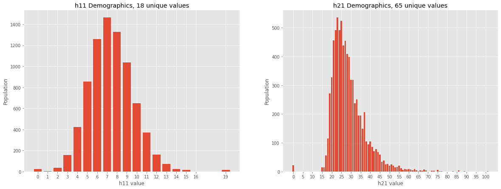

# Statistics of the CICY3 Dataset

This is an overview of some statistical properties of the CICY3 dataset, focusing mostly
on its demographics. The dataset is highly skewed in the target variables. As a example,
_h1,1_ = 16 has only one corresponding element while _h1,1_ = 7 has
more than 1400. The _h2,1_ statistics are even more skewed.

*Demographics of CICY3*

This skewness is characteristic to datasets in string theory and mathematical physics, as detailed 
[here](http://arxiv.org/abs/2011.14442).

We will also outline some interesting correlations between input data and target variables.

