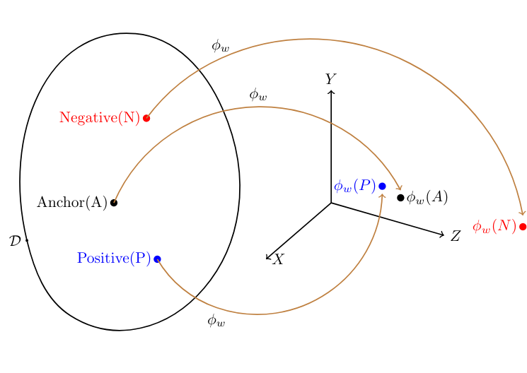
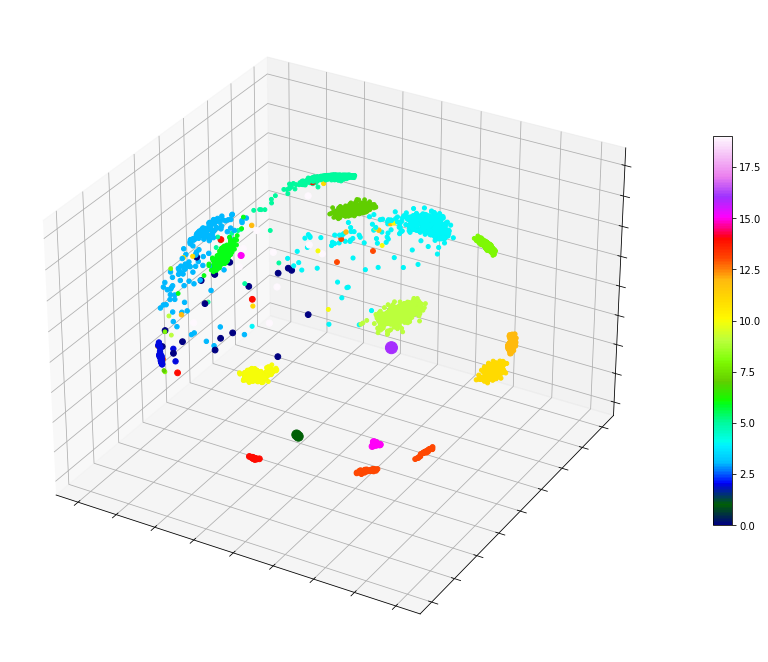

# Siamese Neural Networks applied to the CICY3 dataset
We use Siamese Neural Networks to infer a notion of similarity across the CICY3 dataset.
These networks infer an embedding of input data into an auxiliary _d_-dimensional space
such that similar points are clustered together while dissimilar points are pushed apart.
This is illustrated in the following figure where _a_ is the _anchor_, the reference image,
_p_ is _positive_ i.e. similar to _a_, and _n_ is negative, i.e. dissimilar to _a_.
 
*Visualizing the Siamese Network* 
The details of the network and training are in the [notebook](tripletlosscicy3.ipynb). 

For our analysis, we define two CICY3 manifolds as similar if their _h1,1_ values are
equal. By training the network, we arrive at the following representation of the CICY3 dataset
with similar manifolds visibly clustered together.

*The CICY3 dataset clustered by similarity* 

The distance between the representative points of two manifolds may be interpreted as a _similarity score_,
with similar manifolds having a score close to zero, and dissimilar ones having a score away from zero. This
is explicitly seen in the figure below, which plots the average similarity scores between classes *I* and
*J*. Here each class *I* corresponds to manifolds with Hodge number _h1,1;*I*_. If we visualize these
mean scores as a matrix, then the diagonal elements much be close to zero, and the off diagonal elements must
be far away from zero. We indeed find this property in the Figure below, which is obtained from explicitly
computing these mean scores across all classes in the CICY3 dataset.
 
*The similarity score learned by the Siamese Network* 

